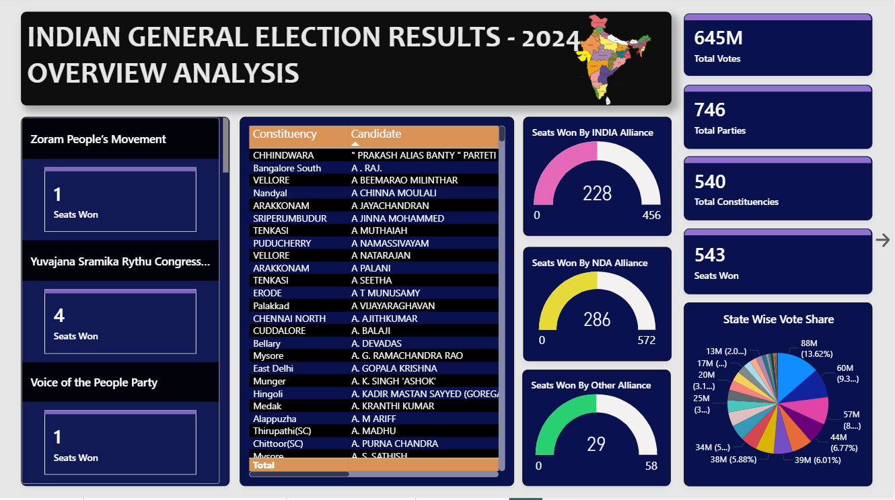
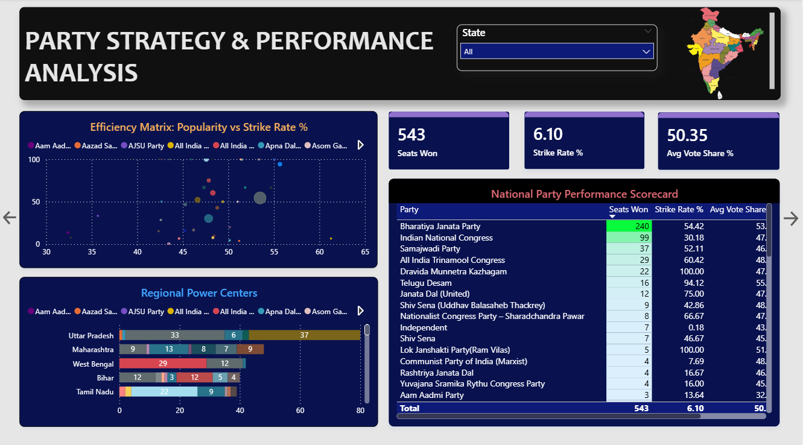
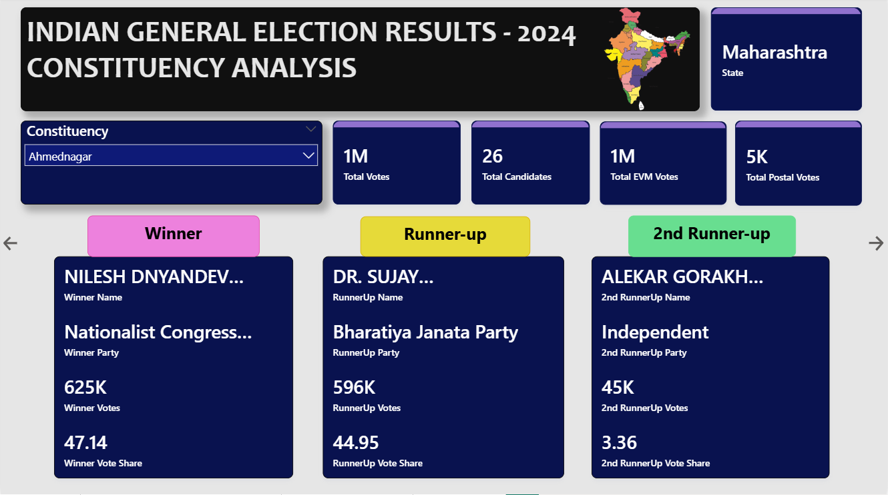
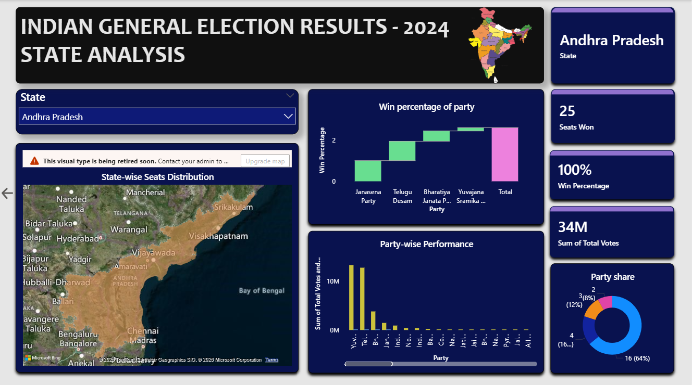

# 🗳️ Indian General Election Results 2024
### Interactive Power BI Dashboard

---

## 📌 Project Overview

The **2024 Indian General Election** was one of the largest democratic events in human history, with over **96 crore registered voters** exercising their franchise across 543 parliamentary constituencies.

This project delivers a **fully interactive, multi-page Power BI dashboard** that transforms raw election result data into rich, visual stories — enabling analysis at the national, state, party, and constituency level. From seat distributions and win margins to candidate-level breakdowns and geographic voting patterns, this dashboard offers a 360° view of how India voted in 2024.

---

## 🎯 Objective

To analyze, visualize, and derive meaningful insights from the 2024 Indian General Election results using Microsoft Power BI — helping users understand electoral outcomes across parties, constituencies, and states through an interactive and data-driven dashboard.

---

## ✨ Key Features

| Feature | Description |
|---------|-------------|
| 📊 **Multi-page Dashboard** | 4 dedicated report pages — Overview, Party, Constituency, and State analysis |
| 🃏 **KPI Cards** | Instant snapshot of total votes, seats won, win %, and avg vote share |
| 🏛️ **Party Performance** | Strike rate, avg win margin, and total seats per party |
| 🗺️ **Filled Map** | Geographic heat map showing state-wise seat distribution across India |
| 🔍 **Constituency Drill-down** | Winner, runner-up, and 2nd runner-up details per constituency |
| 🎛️ **Dynamic Slicers** | Filter by state, party, constituency, or candidate in real time |
| 📉 **Waterfall Chart** | Gain/loss visual for seat changes across major parties |
| 🎨 **Professional Theme** | Clean, modern CopilotDefault theme with consistent color palette |

---

## 📊 Dashboard Pages

| # | Page Name | Description | Key Visuals |
|---|-----------|-------------|-------------|
| 1 | **Overview Analysis** | National-level summary — total votes, seats, and overall performance metrics | KPI Cards, Bar Chart, Donut Chart, Slicer |
| 2 | **Party Strategy & Performance** | Party-wise performance — candidates fielded, strike rate, win margin, and vote share | Clustered Column, Scatter Chart, Waterfall, Gauge |
| 3 | **Constituency Analysis** | Candidate-level view — winner, runner-up, 2nd runner-up votes and vote share per seat | Table, Bar Chart, Card Visual, Slicer |
| 4 | **State Analysis** | State-wise breakdown of seat share, dominant parties, and regional voting patterns | Filled Map, Pie Chart, Column Chart, Slicer |

---

## 💡 Key Insights

- 🏆 **Seat Distribution** — Visual breakdown of how all 543 seats were distributed among parties and alliances
- 📍 **Win Margins** — Constituency-level and average win margins highlight closely contested vs. dominant victories
- 🗺️ **Regional Voting Patterns** — Filled map uncovers geographic concentration of party strongholds across India
- 📈 **Party Strike Rate** — Measures electoral efficiency: seats won relative to total candidates fielded per party
- 🗳️ **EVM vs. Postal Votes** — Comparison of electronic and postal ballot counts across constituencies
- 👤 **Candidate-Level Performance** — Identifies top winners, closest contests, and key battleground seats
- 📉 **Seat Gain/Loss Analysis** — Waterfall chart visualizes party-wise seat changes and electoral momentum

---

## 🗂️ Dataset

| Attribute | Details |
|-----------|---------|
| **Source** | Indian General Election 2024 — Official Results |
| **Table Name** | `GE_2024_Results` |
| **Coverage** | 543 constituencies across all States & UTs |
| **Total Columns** | 27 fields |
| **Data Type** | Structured tabular data (CSV / Excel) |

---

## 🛠️ Tech Stack

| Technology | Category | Usage |
|------------|----------|-------|
| **Microsoft Power BI Desktop** | Visualization | Report design, dashboard layout, publishing |
| **DAX (Data Analysis Expressions)** | Data Modeling | Custom measures, KPIs, calculated columns |
| **Power Query (M Language)** | ETL | Data ingestion, transformation, and cleaning |
| **Excel / CSV** | Data Source | Raw election results dataset |
| **GitHub** | Version Control | Repository hosting and project management |

### 🎨 Visuals Used

| Visual Type | Usage |
|-------------|-------|
| Card Visual | KPI metrics — total votes, seats, win % |
| Bar Chart | Party-wise and state-wise seat comparison |
| Clustered Column Chart | Multi-party performance comparison |
| Donut & Pie Chart | Vote share and seat proportion |
| Filled Map | Geographic state-wise distribution |
| Scatter Chart | Strike rate vs. vote share analysis |
| Waterfall Chart | Seat gain/loss by party |
| Gauge | Performance indicators |
| Table | Detailed candidate-level data |
| Slicer | Interactive filtering by state, party, constituency |
| Action Buttons | Page navigation controls |

---

## 📷 Dashboard Preview

| Page | Preview |
|------|---------|
| 📊 Overview Analysis |  |
| 🏛️ Party Strategy & Performance |  |
| 🔍 Constituency Analysis |  |
| 🗺️ State Analysis |  |

---

## 📁 Repository Structure

```
Indian-Election-2024-PowerBI/
├── Infosys_project.pbix        # Main Power BI report file
├── README.md                   # Project documentation
├── dataset/
│   └── GE_2024_Results.csv     # Source election dataset
└── screenshots/
    ├── overview.png
    ├── party.png
    ├── constituency.png
    └── state.png
```
